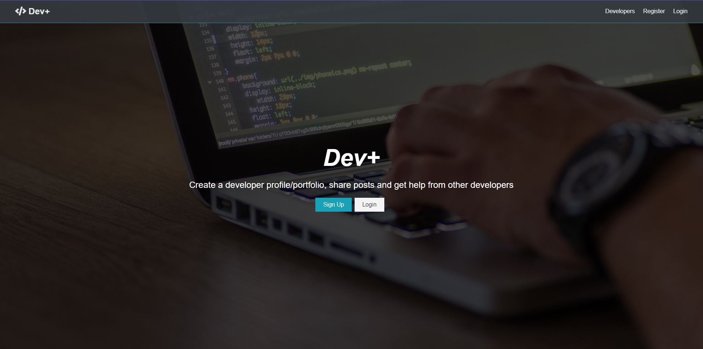
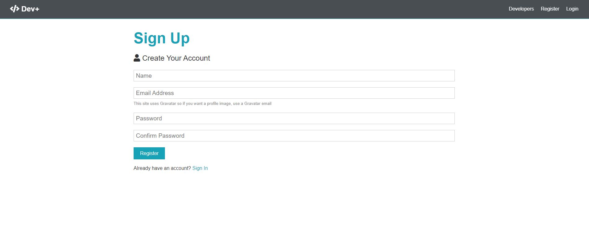
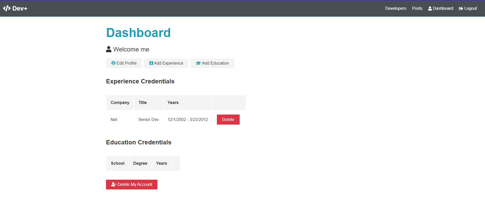
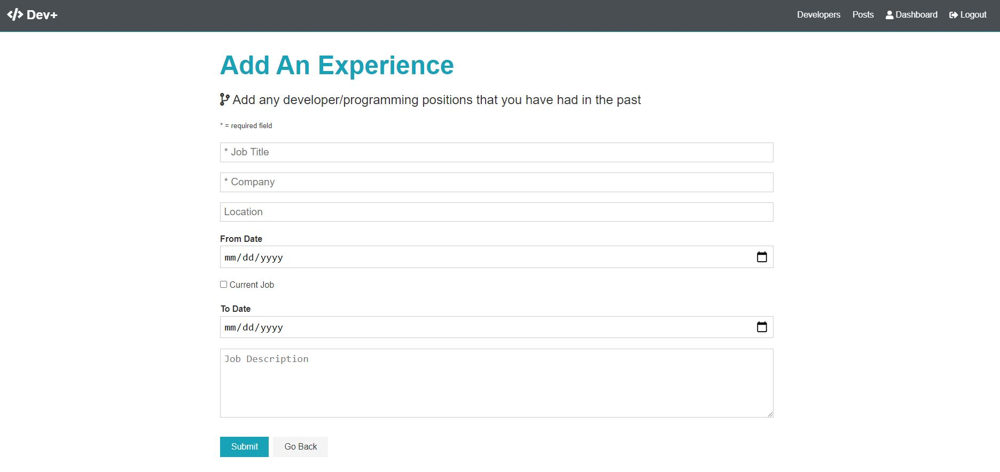
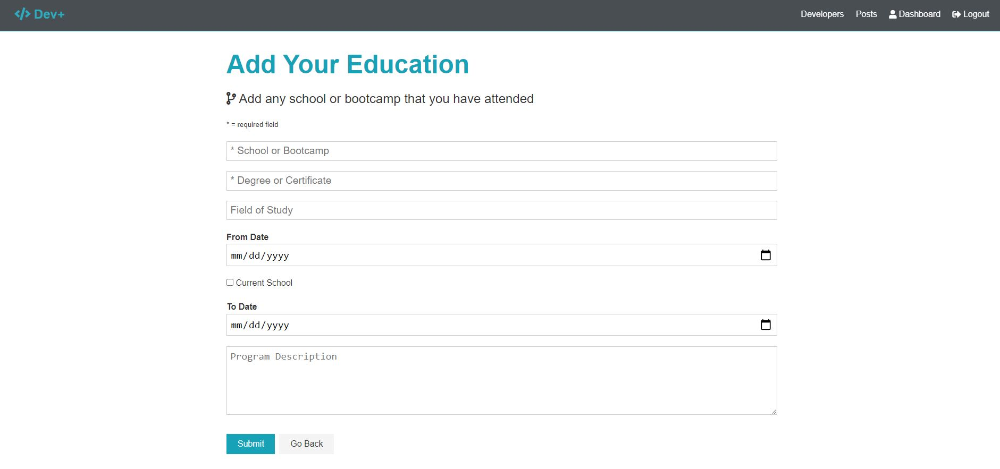

# Dev+

<p align="center"> 

</p>

<p align="center">
 <a href=""></a>
 <a href=""></a>
 <a href=""></a>
 <a href=""></a>
</p>

## Table of Contents

-  [Description](#description)
   -  [User Story](#user-story)
-  [Technologies](#technologies)
-  [Usage](#usage)
   -  [Deployment and Demo](#deployment-and-demo)
   -  [Screenshots](#screenshots)
   -  [Tips](#tips)
-  [Developer](#Developer)
-  [Contributing](#contributing)
-  [License](#license)

## Description

You are enrolled in a school and want to be checking in on your reports and results for the school and class that you are in, you want to have a functionality to be able to download the report and also set up an account that will give access to your school reports in the future so that you don't have to be collecting papers or even keeping track of your emails 

Coursely is an online application that helps students to have a connection and access with their school by accessing reports on a yearly basis and also have access to course materials to enable students keep track of what areas they would like to succeed in. Teachers are able to post and update reports basing on the academic term and also through online tests attempted by students

### User Story:

```
User Story
As a Developer i want to be able to communicate with my team on the application
As a Developer i want to be able to have an account that i can update my information like previous employment and education
```

## Technologies

-  [Bootstrap](https://getbootstrap.com/)/[CSS3](https://www.w3schools.com/css/default.asp)/[HTML5](https://www.w3schools.com/html/)
-  React
-  Redux
-  Mongoose
-  Postman
-  [Git](https://git-scm.com/)/[GitHub](https://github.com/features)
-  Node.js
-  [Express.js
-  dotenv
-  JsonWebToken 

## Usage

A first time user opens the website and then creates an account and then fills in all required and necessary information to build a profile

1. When an account is created, the user will then have access to create a post that and also comment with other developers on the platform

2. The user is also able to go back and make changes to their profile incase its needed.


### Screenshots
### Click on the arrows to drop down more images of the app.

<details>
  <summary>Home Page</summary>
  

</details>
<details>
  <summary>Register</summary>
  
</details>
<details>
  <summary>Create Account</summary>
  
</details>
<details>
  <summary>Add Experience</summary>
  
</details>
<details>
  <summary>Add Education</summary>
  
</details>

## App Demo 
 <!-- 
</details> -->

### Tips

1. You are able to clone this repo or download a zip file to your local machine.
2. If you have cloned a repo and a package.json exists, you are able to see the dependencies and dev dependencies used in the application. If this is the case run the below command to get all the dependencies need for that application. Open client and "npm i" and the server as well

```
$ npm i
```
3. Regarding CORS, i have added the origin of the client side (browser) in the server, so technically you need to run both instances of the server and client in order to access client resources and also access server responses and requests

4. In order to run application after cloning the repo run 

### For Server directory run :
```
npm start  
```
### For Client directory run :
```
npm start  
```
## Developer

-  Farouk Kisuule- [https://github.com/Farouk994](https://github.com/Farouk994)

## Contributing

Steps to contribute:

1. Fork the repo on GitHub.
2. Clone the project to your own machine.
3. Commit changes to your own branch.
4. Push your work back up to your fork/branch.
5. Submit a Pull Request so that we can review your changes.

## License

[MIT Copyright © 2021]